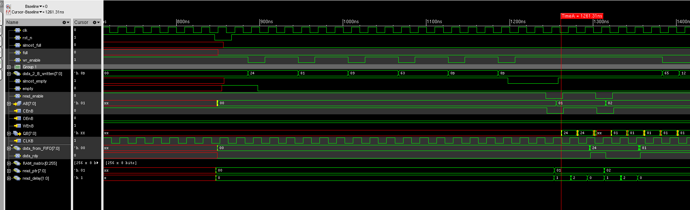

# Mini ASIC chip tape out aka project LANA

This is the log for mini ASIC tape out project to implement the FIFO with embedded RAM IP.

This project is named project _**LANA**_

## 23 Aug 2024

I have reviewed some papers about LVDS and high-speed interface and feel that this might be a tricky topic to address at the moment. This is because it involves both digital and analogue design technique to achieve and probably level shifting.


So I wanted to drop this topic just now and proceed with the IP implementation flow for now with the newly generated 6 metal RAM block.

I will start again with synchronous FIFO implementation.

And I want to establish an automatic flow for synthesis and place and route along this way so that I can just rerun when I need to.


First I will have to organise the Verilog implementation again and set this up functionally.

Since I have drafted the behavioural model for sync FIFO, I will just use the version 1.0 and make small tweaks on it.

Apart from the old header, we will use an additional ready signal to indicate the read data is available. This is a new feature I added on asynchronous FIFO.

This signal will be asserted when data is ready until the new ready signal is asserted.

Also the behaviour for flagging almost full and almost empty has been updated with a more comprehensive logic where

```Verilog
assign almost_full = (!empty) && ((read_ptr + FIFO_size - write_ptr) % FIFO_size <= threshold);
assign almost_empty = (write_ptr + FIFO_size - read_ptr) % FIFO_size <= threshold;
```

almost full may be incorrectly triggered when read_ptr == write_ptr and therefore should be added with one extra condition of not empty.

Now I shall start the synthesis stage.


### Synthesis

And it seems that so long as you load the liberty file and LEF file into the tool, you do not need the Verilog file of the IP to work.

And I am setting the clock period at 50MHz for synthesis using constraint file, now the sdc file is a minimal file.

This one will have a scan path through the design.

Synthesis finished, it was fairly quick.

Now I can probably run a post-synthesis simulation?

Just ran a post-synthesis simulation, and it appears that the writing process has not been impacted, but the reading process is a little problematic.

somehow, the internal read_delay was not updating itself.

Think there might have been a timing issue that I have missed.

Will check the log now.


I will now rerun the synthesis and specifically check out what read_delay has been connected to.

And also somehow the synthesis decided the most significant bit of write_ptr is not connected and left at high-impedance.

So far the behaviour looks very odd, and I will come back to this next week.


## 27 Aug 2024

I shall go back to the synthesis and see if the problem is reproducible and probably have a good look at the schematic, or send the design through conformal check.


I will send the design through conformal check first.

### Conformal LEC check

The LEC conformal check report back that two designs pre/post synthesis are equivalent except the black box.

This has got me wonder what has happened during synthesis.

It probably means that the logic has been redundant and pruned.


### Redo Synthesis

now the synthesis redo has been finished, I do not spot any apparent errors or warnings that worth noting.

Will have to rerun simulation again.

And I am using the general digital library Verilog file to do the simulation.


Ok, there are warnings talking about the timing annotation failed on the non-existent paths, which means that the digital library Verilog is not the right one for simulation.

But this simulation shows correct behaviour.

Will now do the simulation again with the library with timing information.

The problem was reproduced, not sure what the problem is, I will try to extend the read_enable timing.

I extended the period of the read enable from 20 to 40 and then the simulation worked.


I think it is because of the setup timing violation encountered during simulation, this is because the read_enable has only been asserted low 4 ns prior to the positive edge of the clock.

Now I will try to assert the read_enable near the negative edge of the clock and then re run the simulation.

And now it works miraculously well.


After couple testing, it could be concluded that the assertion should be at least 7 ns ahead of the posedge of the clock.

Since I have checked the behaviour of the design and it is correct, I will now move on and start the PnR implementation.


### Place and Route

I will now need to write up the MMMC file 😭.


## 28 Aug 2024

### Place and Route (continued)

I drafted the MMMC file with 3 different analysis view where they are described below:

From the document, the power supply for the IP should be 20 um wide at least.

So I have tried to power the design with 20 um power stripes, in the meantime, I will also add a power ring around the RAM block.


## 29 Aug 2024

### Place and Route (continued-continued)

To avoid dangling wires along each rows, I extended the margin left at the left and right side.

This has allow me to leave two big power rails at the margin area so that the metal 1 can be connected.

Also I can add the ring first and then add the stripe to allow it to be merged with the block ring wherever possible.

I placed the cells and there is only very very little areas used for actual cell placement.


There are couple of problems that need to be addressed.

+ There are dangling wires of the cell power rails, these are mainly because there are no via connections made on the block ring.
+ There are feedthroughs on the RAM block. (Potentially, this is not a problem)
+ The tie high and tie low signals on the RAM blocks are not connected.
+ The utilisation rate in this floor plan is disastrous. 


I will need to address these in my next version of application.


In the meantime, I need to search for the FPGA LVDS availability and how fast they can go.


### FPGA LVDS support search

I will mainly check Xilinx board 7 series at the moment for the I/O support.

According to the product selection guide listed [here](https://docs.amd.com/v/u/en-US/7-series-product-selection-guide), the I/O resources listed on an FPGA are listed below in the table.

But it is worth noting that not **ALL** ports can be fully used.


#### Artix-7

There are different FPGA parts with the I/O resources listed in the table below:

| Part number   | XC7A12T | XC7A15T | XC7A25T  | XC7A35T | XC7A50T | XC7A75T | XC7A100T | XC7A200T |
| ------------- |---------| --------| ---------| --------|---------|---------|----------|----------|
|Max single-ended I/O|150 | 250 | 150 | 250 | 250 | 300 | 300 | 500|
|Max differential pair| 72| 120 | 72  | 120 | 120 | 144 | 144 | 240|


#### Kintex-7

| Part number   | XC7K70T | XC7K160T | XC7K325T  | XC7K355T | XC7K410T | XC7K420T | XC7K480T | 
| ------------- |---------| --------| ---------| --------|---------|---------|----------|
|Max single-ended I/O|300 | 400 | 500 | 300 | 500 | 400 | 400 |
|Max differential pair| 144| 192 | 240  | 144 | 240 | 192 | 192 |


#### High-Speed Serial Transceiver

There is a map that shows the count number of the high-speed transceiver count numbers by different products.


Attached are some user guide to use [GTP transceiver](https://docs.amd.com/v/u/en-US/ug482_7Series_GTP_Transceivers) and [GTX/GTH transceiver](https://docs.amd.com/v/u/en-US/ug476_7Series_Transceivers)

Here is another map of aggregate bandwidth:


And finally, there is a figure that shows the total I/O count and total bandwidth in Gb/s 


In the Artix-7 product brief, it was mentioned that the double differential I/O standards with speed up to **1.25 Gb/s** LVDS performance

After checking these details, I think I know how these numbers are calculated.

For a GTP transceiver with max speed of 6.6 Gb/s,

Transceiver aggregate bandwidth = 2 X number of transceiver X 6.6

Therefore, XC7A12T, which has 2 GTP transceiver, has 2 X 2 X 6.6 = 26.4 Gb/s.

It has to multiply by 2 because we are counting the duplex working bandwidth.

Total bandwidth simply just used 150 X 1.25 = 187.5 Gb/s


#### AC701 Evaluation board kit of Artix-7

The board I have been checking is [AC701 evaluation board](https://docs.amd.com/v/u/en-US/ug952-ac701-a7-eval-bd), which ships with the XC7A200T


The AC701 board provides access to eight GTP transceivers:

+ Four of the GTP transceivers are wired to the PCI Express x4 endpoint edge connector (P1) fingers
+ Two of the GTP transceivers are wired to the FMC HPC connector (J30)
+ One GTP transceiver is wired to SMA connectors (RX: J46, J47 TX: J44, J45)
+ One GTP transceiver is wired to the SFP/SFP+ Module connector (P3)


## 30 Aug 2024

Now I am restarting the implementation in the virtuoso environment innovus.

Where I invoke innovus in the directory where OA libraries are accessible.

This is a better way to implement the design for later virtuoso import.

Somehow the tool reports that there is no physical data for certain cells.


I chose TECH_XH018_HD as the technology library instead of TECH_XH018.

I am wondering if this could be the problem. I will now switch to TECH_XH018 instead.


**PROBLEM SOLVED!**


Technology library should be **TECH_XH018** instead of **TECH_XH018_HD**.

This made me wonder if I have made a mistake by using HD tech lef file instead of the normal lef file.

But this should not impact the synthesis, because we did not do physical synthesis iSpatial flow.

Now it is reporting something that feels like unresolvable, where it complains the special net VDD/VSS distance is too close.


But this cannot be fixed if we have this distance set up by the RAM IP block.


I am thinking if it is because I chose 1143_HD when generating the RAM IP block.


Also I just realised that the supporting power rail only has to be thicker than half of the Wxfmc.


And also considering the limited ports, I shall regenerate another FIFO DPRAM with width of 8 and restart the implementation.

And I also realised that the IP has a technology code as in 1133??

Which is not what we are using if my memory serves.

Our design should be 

**MET4+METMID+METTHK**

not 

**MET3+METMID+METTHK**


Now I am regenerating a new FIFO RAM!!! It should have the process code of 1143 and MET4+METMID+METTHK.

Also it will only have 128 entries and 8 bit wide.

I will also generate another 256 entries and 8 bit wide.

I also left the load capacitance alone this time with default 0.2pF.

In terms of variation, I am creating the one that's closest to a square.


### Start over again with 128X8 FIFO

I have just drafted the verilog module again for this FIFO, simply change some parameters and that's it.

This will be extended to next week to complete.


## 02 Sep 2024


Since I have already drafted the verilog for 128X8 FIFO, now I just have to do another round of simulation to check out the behaviour.

As expected, the behaviour is correct.

Now I will head to the Synthesis again with 125 degrees.

Synthesis finished without any error.

Now doing the conformal check...

conformal check passed...

Now heading to place and route...

draft up the MMMC file and constraint files...

OK this MMMC file finally passed...

Moving the work to the virtuoso environment for PnR...

Dont know why I am having this error again about the physcial cells not found??

reload innovus again and this is fixed?

Now I have just did a special routing, and this is the least DRC I have ever seen.


Now I guess I need to fix these errors manually


## 03 Sep 2024

### Fixing DRC erros brought by via generation

There are loads of errors brought by the via generation they are either too close to each other.

Mainly at the via between metal 4 and metal 5, the tool used a fixed via cell to place on top of each other, this will inevitably make the vias overlap or leave no space between vias.

I tried to create my own customised via which seems to be ok to address this issue.


I drew a horizontal metal 4 that is equally thick and manually added 5 vias (4 on the left and 1 on the right) and made sure they satisfy the DRC rule.

And the DRC error typically looks like this:


After I fixed it manually, the layout looks like this:


I have just fixed all the DRC errors in my design.

Now I am doing cell placement.

The tool used Metal 6 over the RAM block, but this has not been finalised and there are routes overlapped.

and apparenlty, the RAM module has an area that is not allowed for routing namingly OBS.


After checking the details on virtuoso, it looks like the routing blockage for metal 6 is tiny, and the routing we have in innovus should actually be ok.


Finished clock tree synthesis, now 2 buffers added for the clock tree distribution.

we still have hold time violation.

Now we are optimising the route for hold violation.

And then the violation is fixed, it looks the tool inserted some buffers.


## 04 Sep 2024


I will continue the place and route from yesterday following the clock tree synthesis and hold timing violation fix.

Suprisingly, routing finished pretty quickly with only minor errors.

And there is no routing above the block using other than metal 6.

There is no DRC errors but 9 connectivity errors mainly in 2 catelogues:

+ Antenna side area ratio 
+ dangling wires of the power stripes.

After trimming the unnecessary power stripes, the dangling wires violations are all fixed except the antenna side area ratio violation.

I will have a look online and see if there is any tutorial.

So this [article](https://chipedge.com/what-is-the-antenna-effect-in-vlsi/#:~:text=Antenna%20Violation%20occurs%20when%20the,the%20conductor%20(gate%20area).) talks about what the antenna ratio is and possible solutions.

There is another [article](https://www.edn.com/antenna-violations-resolved-using-new-method/) talking more comprehensively about the solution and causes.

So basically, antenna ratio is the ratio of gate area and gate oxide area.

and the solutions it proposed includes:

+ Metal jumper
+ Diode insertion

Metal jumper will break the signal line and use jumpers to route them on a top metal.

The second solution will attach the diode to the wire and establish a discharge path


### What is Antenna effect

It is also known as plasma-induced gate-oxide damage or plasma-induced damage.

It occurs when unwanted charges accumulate on exposed conductors during fabrication.


I will proceed from now, cus there is no DRC error and connectivity error.

The design will be saved 


### Fixing antenna violation

I therefore followed metal hopping method to fix the antenna hopping.

Before the metal hopping, the violation exists for signal CLK.


After I broke the signal CLK net and did a little wire editing, the antenna violation is fixed.


## 05 Sep 2024


I shall give the implemented design a post-layout simulation and conformal verification today.

Ok, it looks like the design passed the behaviour check...


It is worth noting that because the highest bit of register write_ptr is at the end of the scan chain, it was therefore replaced by scan_out during optimisation.

Surpsingly it works.... and the simulation also works even if I did not type in the Dual port ram verilog file???

I am still scratching my head about this...


Now let me do the conformal check for the design...

It it reporting 20 nonequivalent DFFs...


I should now probably check how conformal works.


## 09 Sep 2024

I guess I can probably do another FIFO implementation with 256 entries of DPRAM

Behaioural simulation passed !

post-synthesis simulation passed !

LEC conformal check passed, except the DB input not mapped. This is beacuase in the original code, they are not connected to anything. During synthesis, it has been all connected to ground.

In conclusion, LEC check passed !

PnR now... this shall take some time.


## 10 Sep 2024

I have managed to push the design forward to finish the placement.

This also includes clock tree synthesis, but it seems the placement preference has been down at the bottom of the RAM.

Basically all the cells are placed under the RAM.


And this got me thinking I should probably start over with a different floorplan, I mean the side areas are basically not used.


## 11 Sep 2024

I have finished the design for FIFO 256, will start testing tomorrow.

The final layout looks like this:


But I am having a lot of concerns for this design.

for example, I did not reorder the scan chain to make the placement more efficient.


## 12 Sep 2024

Just checked the 128 FIFO design and realised there are still some connectivity errors need fixing.

Will come back to this tomorrow, and if necessary, I will start over with the place and route.


## 13 Sep 2024

I am now coming back to the reimplementation of the 128 FIFO after I realised how messed up the last implementation was.

And I am also getting the scan chain reordered to have a better placement.

And I am also connecting the DB of the RAM to the ground.

Just redid the implementation of the FIFO 128 after checking and fixed everything.

this has now been saved in Sync_FIFO_XDPRAM_128X8 as FIFO_128_redo.

Will get the functionality verified next


## 14 Sep 2024

Since I have got the implementation finished, I will now get the functionality verified. 

Oh and also get this conformal checked.

I just learnt that while writing out the SDF files, you can put the options of PVT informations like follow:

And according to innovus, it is recommended to turn on recompute_delaycal for functionality simulation.

It is normally turned off for faster computation.

```Tcl
 write_sdf -process best:typical:worst -voltage 1.98:1.80:1.62 -temperature -40:25:125 -recompute_delaycal FIFO_128_8_XDPRAM/PnR/outputs/FIFO_128_redo_final.sdf  
```

And the functionality has been verified to be ok.


Also I noticed that the tool complained about the timing declaration missing from key verilog files, which has never happened before.


I will head on to the conformal check.

This has reported the similar situmation as before, so I would assume it is the behaviour that might exist commonly with innovus.

Even though I have not verified the scan chain from the design.

Continuing with the 256 implementation, I see that I should add tie high and tie low cells before placing the cell.

But there are 2 types of tie hi/lo cells, with with low voltage optimisation, one without.

I will stick to the normal one again.

And also this time, I set a placment blockgage so that the cells will not be place under the power stripes.

While adding fillers, I noticed the error messages saying the site has been defined as "HD":

```text
**ERROR: (IMPSP-365):	Design has inst(s) with SITE 'core_hd_dh', but the floorplan has no rows defined for this site. Any locations found for such insts will be illegal; create rows for this site to avoid this.
```

I think it is complaining about the double height fillers because of the field defined and therefore, there are no double height filler cells inserted.

of course there are antenna violations...

And due to the right side of the RAM block not aligned with the edge, there are fillers cells placed, and this has caused basically every row's power rail to be open.... shiiiiiit.

Let me start over again....

But because reallocate the placement for the RAM is going to bring extra more work, I will just add a placement halo to the right.

Now I have finished FIFO 256 reimplementation too, I will probably head on for further up integration.


## 17 Sep 2024

Today I can get this physcial implementation verified probably using simulation and/or conformal.

The behaviour looks correct except the signal almost_full is a little glitchy but it should not be a problem.


and I would assume the confomal check still cannot pass because of the slightly rearranged DFFs.

Of course, as expected, there are non-equivalent DFFs 

But I am going to go ahead and ignore this for now...

There are couple points I may want to revisit again in the future.

It seems that I am wastig an extra cycle here at reading out process according to the simulation.



I also need to consider carefully about the chip level integration now.

Like, how this data loop should look like and how many pins I need.


## 23 Sep 2024

Think I have a plan for the whole chip design. 

Because what we have in mind is very simple, just a simple data loop.

Serial/parallel in --> parallisation --> FIFO --> serialisation --> serial out

And this time, I would like to use 512 rows of DPRAM.

About the wasted extra cycle, it is clearly illustrated from the behavioural simulation that there is no extra cycle wasted.

And the behaviour I drafted will make sure the correct data can be exported.


Steve's email makes me realise my concern is valid, like this IP purchase may not be economical, which might only be used once.

Because we might need to switch technology later on.

But the RAM should be able to fit in.


a 256 words 8 bit DPRAM is 337.11μm x 210.61μm

And 512 words 8 bit DPRAM is 339.79μm x 297.97μm

The die size for this miniasic should be 1520μm x 1520μm


256X8

337.11 X 210.61

512X8

339.79 X 297.97

FIFO imp:

422.49 X 284.87


I aslo finished the RTL for input handler, which should be hooked to the FIFO's input.

Will implement the output handler tomorrow, which should take the FIFO's output and then serialise it to SPI protocol.
